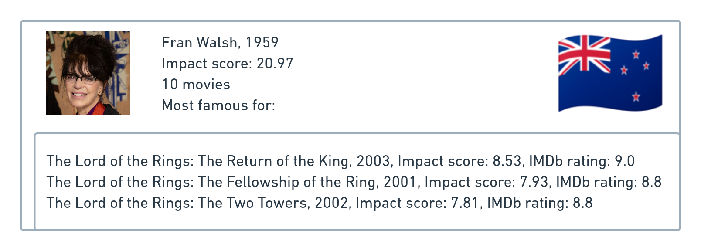
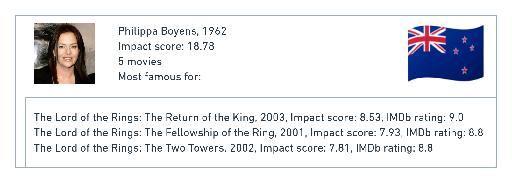
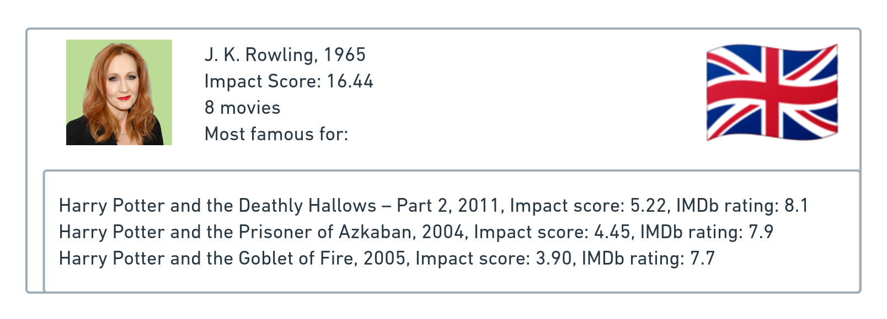

<head>

</head>

# Women and Movies

The representation of women in media has long been a topic of interest, as it reflects societal norms and attitudes towards gender equality. Despite the progress made in recent decades towards gender equality, it is important to examine whether these changes are reflected in the films we watch. Movies provide a unique insight into the subconscious ways in which society is conditioned to view women, and can capture the ideals and norms of the time in which they were produced. 

In this data analysis project, we will use the CMU Movie Summary Corpus, completed with additional datasets, to explore the portrayal of women in film. We will not only analyze the roles of actresses and characters, but also of writers and directors. By analyzing these factors, we aim to gain a deeper understanding of how women are and have been represented in media, and how this has evolved through time.

# The Data

Our analysis is based on merging the [CMU Movie Summary Corpus dataset](https://www.cs.cmu.edu/~ark/personas/), the [Stanford CoreNLP-processed summaries](http://www.cs.cmu.edu/~ark/personas/data/corenlp_plot_summaries.tar), [IMDb](https://www.imdb.com/interfaces/), [Wikidata](https://www.wikidata.org/wiki/Wikidata:Main_Page), [IMDB](https://www.imdb.com/interfaces/) and [Box office Mojo](https://www.boxofficemojo.com/). We have separated the data into three tables: the movies table, the characters table, and the directors and writers table.

* The movies table contains titles, release year, runtime, box office revenue, average rating and number of votes on IMDb, genre, as well as the list of directors and writers. There are a total of 81,741 different movies.



* The characters table contains the ID of the movie, the character name and actor name, their height, ethnicity, birth and death year, the movie metric and the actor metric. There are 450,669 characters played by 135,761 different actors.



* The directors and writers table contains titles, role (either director or writer), name, gender, birth year, and height. There are a total of 86,474 directors and 164,271 writers.



## The Impact Score metric
### Movies
We have created a metric in order to measure the impact of a movie on the average rating and the number of votes. Our assumption is that an impactful movie has a lot of votes and has either an extremely good or bad average rating. The number of votes were used as a proxy to gauge the number of people that may have watched the movie, another benefit of using this feature is that to cast a vote takes effort and it is intuitive that someone would likely put in this effort if a movie was impactful on them or they are someone who is passionate about cinematography. An exetremely good or bad rating shows that a movie stood out from other movies and on either end of the spectrum is impactful as it may impact how future movies are produced.

We apply a logarithmic transformation to the number of votes in order to account for the heavy-tailed distribution and then normalized the data so that it does not outweigh the contribution of the rating to the impact score. We then take the absolute value of the normalized average rating for each movie. This accounts for both very good and very bad movies, as both have a significant impact on audience reception. By combining these two factors, we are able to calculate the overall impact a movie has on its audience and compare this across different films.

$$\textrm{Impact Score}_\textrm{Movies} = \textrm{normalized} (\log(\textrm{number of votes})) \cdot \textrm{abs}(\textrm{normalized}(\textrm{IMDB rating}))$$

According to this metric, those are the top 10 most impactful movies of our dataset:



### Actors, writers and directors
For actors, writers, and directors, we use the [Discounted Cumulative Gain](https://en.wikipedia.org/wiki/Discounted_cumulative_gain) to rank the movies they are linked to according to the impact score and compute their overall impact.

$$\textrm{Impact Score}_\textrm{Actors, Directors, Writers} = \sum_{i=1}^{\textrm{number of movies}}\frac{\textrm{movie metric}_i}{\log_2(i + 1)}$$

Here are the top 10 actors, writers and directors with the highest impact score:



We can see that the top 10 actors, writers and directors are all male, which leads to the following question: *where are the women?*

# Where are the Women?

As our project focuses on the representation of women in movies, it can be interesting to look at the evolution of the presence of women in movies, as characters and as part of the crew.



From the graph above, we can see that women in crews have always been even more underrepresented than actresses.

Let's break the data down by genre, to see if there is any difference in the distribution of women in film across genres.




From the graphs above, we can see that when it comes to genre, women are most often represented in dramas, comedies and romances, while they are underrepresented in action adventure and sci-fi films.

When considering the representation of women among directors and writers, we found that the pattern is similar, although the overall percentage of women in these roles is significantly lower than for actresses, as shown below.



# Behind the Camera
When a movie is being created the ones that have the most influence on the way that women will be portrayed are the people who control the overarching story: The directors and writers. To understand exactly how the impact of female directors and writers has changed throughout time first we accessed the demographics involved to understand how the situation has changed over time. The figures below show that throughout time the number of male directors and writers in comparison to female directors and writers has always been low, but has increased in recent decades.




To dig deeper we asked In which genre of movie are there the highest number of women working in a team on average? The 10 genres with the most movies have been plotted corresponding to how their percent of females in a team change by decade below. The labels in the legend can be clicked to change the visibility of genres on the plot.



It can be seen that in general women are becoming more prevalent in the teams that write and direct movies. Echoing the previous figures there has been an increase of women in movie teams in most genres. Notably in Romance, Drama, and Family movies there are a large percent of an average team being female while in Thriller and Action movies there are few.

Another way to understand how women are distributed as directors and writers among the movies that are created is to look at the distribution of the percentage of women on movie teams as shown in the figure below.



From the above figure it can be seen that a majority of teams do not have any women on them at all.

## Directors and Writers as Part of a Movie
Now that we can see that women are becoming more prevalent in the teams that create movies it begs the question: “what impact are they having?” Using the Movie Impact Score metric we can analyze the impact that female directors and writers have on the movies they work on. 



The above figure showing the average movie impact score for varying percent of a team being women over the entire dataset as well as split into before and after the start of the 21st century with 95% confidence error bars. While it can be seen that for a low, but above 0, percent of women on a team (10%-40%) there is a statistically significant increase in the impact of a movie, but the amount of change in impact can be deemed as negligible. The data shows that regardless of the ratio of women and men working on a movie the impact that movie has is more or less the same.

A linear regression model was fit to gender data and genre data to determine what effect both may have on the impact score of a movie. The gender based features that were used in the model were: The percent of women on the directorial team, the percent of women on the writing team, whether there was a female director at all, if the team on the movie was all male, or if the team on the movie was all female. The model achieved a low R-squared score of 0.12 meaning that it was only able to model 12% of the variance in the dataset and while some of the gender features where statistically significant with p-values lower than 0.05, the weight of these features (percent of directors that are women, percent of writers that are women, and if a team is only made up of men) was too small to make a noticeable difference. The impact being a small decrease in impact score for increasing director or writer percentage and a small decrease in impact for a team that only has men. To visualize the data another way the same graph from above was plotted broken down by the top 10 most produced genres.



The above figure shows that there isn’t a clear linear trend across genres for how the average impact score of a movie changes with the percent of women on a movie’s creative team. 

## Directors and Writers as Individuals
Beyond measuring the impact that a director or writer has on one particular movie we can also analyze the impact that a director or writer has had over their career using discount cumulative gain. For the following analysis directors and writers were considered together to calculate their impact score. The following figure shows the average director and writer impact score broken down by gender and decade with 95% confidence intervals.



It can be seen that while male directors and writers have increased in their impact on the industry overall that female directors and writers have not leading to the average male director or writer being more impactful than the average female director or writer. It can also be seen that there is more variance in the impact that women can have on the movie industry in comparison to their male counter parts likely due to there being a significantly less number of them in the dataset.

The data used in this analysis was more often than not heavy tailed and it is important when we talk about impactful people to look at these outliers. The top 50 most impactful directors and writers were analyzed to understand which women, if any, were able to make it into the top of their profession. The impact scores for directors and writers in this case were calculated separately so that we could differentiate impactful women in both careers respectively.




In the case of the directors there were no women in the top 50 directors based on our impact score, the highest ranking female director ranked 270th with a director impact score of 7.82. In the case of writers there were three women in the top 50 with the most impactful one ranking 22nd with a writer impact score of 20.97. 

# In Front of the Camera
## Actors as past of a movie
In order to better understand how the gender distribution amongst actors could influence the impact score, we decided to add the actor appearance order in the movie’s credits to determine if the lead actors were men or women. We achieved this using the Full Cast & crew available on IMDB, as in [this example](https://www.imdb.com/title/tt0068646/fullcredits?ref_=tt_ov_st_sm). We are able to retrieve the order in which the actors appear in the credits of each movie. From this information, we can retrieve the rank of first appearance in the credits of both men and women. For example, if the credits first show two males then a female actor, the rank of the man would be 1 while the rank of the women would be 3.



We can see on the graph above that on average women appear later in the credits than men. Women have therefore less often lead/important roles, as actors who appear earlier in the credits are very often the main characters. Interestingly, women’s first appearance ranking seems to be increasing over the years, compared to men who stay at the same rank. This would mean that female characters got less important over the years compared to their male counterparts.

We continued the analysis by looking at the percentage of female and male actors in each movie, and comparing this number to the movie’s impact score.



Looking at the above histogram, we can see that the bulk of the films have fewer than 50% female actors.



The above graph above shows how the impact score evolves for different percentages of female actors in a movie. There is a difference between the two time periods that remains relatively constant across all percentages. The movie impact score of the 21st century is consistently higher than before the 21st century which could be explained by the fact that newer films are reviewed more than older ones on IMDB affecting the total number of votes and therefore the movie impact score.



Looking more into the percentage of women in movies, we compared film genres between each other. The main observation seen here is that it appears that there is a downward trend between the movie impact score and the female percentage. This means that the higher the female percentage, the lower the movie impact score would be.

To confirm this observation, we decided to perform a linear regression linking the movie impact score with the female actor percentage, the rank of the first appearance of a woman in the credits, and if the lead actor is a woman (for this last metric we assumed that if the woman was first in the credits she was the lead actors).

It takes much more than only those gender-related statistics to correctly model the causes of the impact score of any film. Despite a low R-squared value of 0.01, the results remain nevertheless interesting as all our criteria were shown to be statistically significant. The most impactful feature being the female actor percentage which had a coefficient of -0.5. Therefore the trend we observed earlier can be confirmed, a higher percentage of female actors appears to have a negative effect on the movie impact score.

### Actors as individuals



From the above graph we can see that on average, and for each decade, that male actors have a better actor impact score compared to female actors. One possible reason for such a difference could be that male actors play in more films on average (4.43 films/actor) than female actors (3.76 films/actors).



Looking at the actor impact score broken down by genre, we can see that there is a general upward trend in the actor impact score over all genres. This could once again be explained by the fact that newer films are reviewed more than older ones.

To highlight the difference between men and women in another way, we show in the following plot the 50 best actors according to our metric. It highlights even more the difference between men and women actors in terms of their impact. The first woman appears at the 33rd place in our ranking with a score of 29.57.



# On the Screen

To analyze the way different genders are portrayed in movies, we analyzed the Stanford CoreNLP-processed plot summaries provided for 42,000 movies in the CMU dataset. We use the output of the Stanford CoreNLP pipeline to acquire information about characters. 

Not all characters in a movie are equally significant, we considered the characters mentioned in the plot summaries as main characters as they are valuable enough to the plot to be represented in a condensed description of the movie.



We can see that both for all characters and main characters the distribution mass for males is concentrated towards the right, meaning there are generally more male characters in movies. This tendency is true for all decades. Nevertheless, for the main characters we can notice that the distributions are more balanced.

Since we performed an analysis of the plot summaries, the focus of the analysis was on main characters.

To see how main characters are portrayed in a movie, we extracted the attributes (descriptive adjectives) associated with the characters in the processed plot summaries.

To highlight the differences in attribute distributions we consider unique attributes which are specific to one of the genders. 

The drop in number of unique attributes in the last decade can be explained by the CMU movie dataset was released in 2013 leaving the last decade underrepresented.



We see that the number of attributes is lower for female characters than for male ones, but that the number of unique terms per character is consistently higher for women than for men. This could mean that even though there are fewer female characters they are more developed and thought-through.
Interestingly enough, the general trend of the number of attributes per character is decreasing. Meaning that while there are more characters in movies, they might possess the same set of typical qualities.

### Word clouds 

To get an idea of the kind of data we are dealing with, we looked at the word clouds of unique attributes for each gender and decade. 

An interesting finding from this data is that for each decade popular male attributes include some kind of aggressive characteristic: **enraged, angry, cruel, abusive**



### Word embeddings

Word clouds give us an understanding of certain trends but they focus on exact formulations and not semantics, to capture the similarities of the words and to see if they form some natural groups we performed clustering over the attributes using fasttext to produce attribute embeddings.



For every decade we can find an “aggressive” cluster for male characters, falling in line with our word cloud observations. Another tendency is that negative characteristics are prevalent amongst female attributes throughout all decades: unfaithful, unworthy, sad. Throughout time female attributes traverse from a more temporal nature (current emotions or states, e.g. heartbroken, unloved) to an intrinsic nature (proud, clever, talkative), while male characters have the opposing trend (from intrinsic only to emotional state descriptions). Additionally, women have appearance-related attributes (overweight, hot, ugly) which are less typical for male characters.

### Regression analysis

To verify our “**aggressive**“ hypothesis we performed a regression analysis on the movie plot summaries using sentiment analysis to acquire the general sentiment of a movie plot. Apart from that, we use “**aggression**”, “**dispute**”and **“violence**” lexical categories of the empath sentiment analysis. 

For the scores of each category we made a linear regression model based on the share of female characters in the movie. Of course, the sentiment or aggression score of a movie is impossible objective to model only with information about the share of female characters, which explains the low R-score values that we got with the linear models (0.001 - 0.02). Regardless, for each of the objectives we obtained a statistically significant coefficient for the share of female characters which was negative for “**aggression**”, “**dispute**”and **“violence**” and positive for the sentiment.

This means that the more female characters there are in the movie the less its plot’s aggression/dispute/violence score and the more positive sentiment would be on average.

# Women of Impact
Through our analysis we analyzed the impact of Women in movies and would like to highlight the women throughout time that have made the most impact in their respective career fields and comment on what the data has to say about them.

## Actresses
These are the three most impactful actresses in the dataset:

{:class="img-responsive"}
{:class="img-responsive"}
{:class="img-responsive"}

It is interesting to note that one of Uma Thurman's three most impactful films received very negative ratings, while the other two were rated positively. On the other hand, all three of Cate Blanchett's most impactful films had a positive impact, but Carmen Electra's three most impactful films were largely criticized. 

## Directors & Writers
These are the three most impactful female directors and writers in the dataset:

{:class="img-responsive"}
{:class="img-responsive"}
{:class="img-responsive"}

As a side note, the fact that every woman in both lists are english speakers is interesting, and might be a result of the fact that the dataset is mostly Holywood-centric.

# That’s a Wrap!

In conclusion, as we have seen through our analyses, there is a significant difference between men and women, whether it is in terms of the number of movies they appear in, the number of characters they play, the role they play as part of the crew or the way they are portrayed. 

We have succesfully crafted a metric that reflects the impact of movies, actors, directors and crews. This metric allowed us to visualize the difference in influence that women have versus men in the movie industry. Although we couldn't find a direct and strong link between the gender of actors and crews and the impact of the movie, this data story can been use proof that the movie industry remains heavily unequal, especially for the directors and writers.

