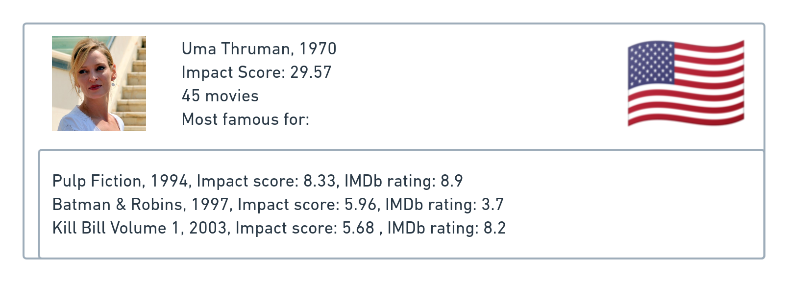
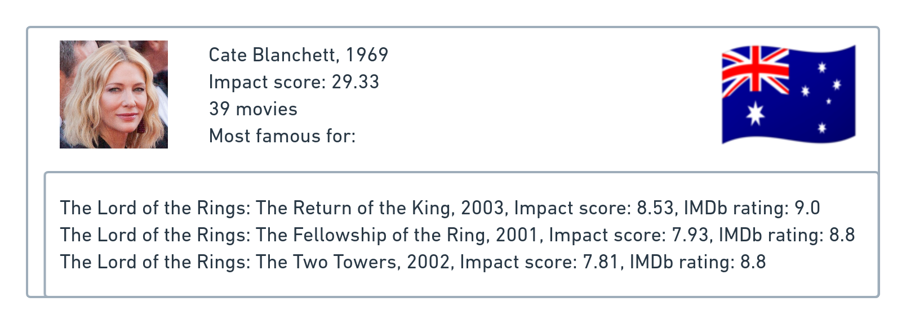
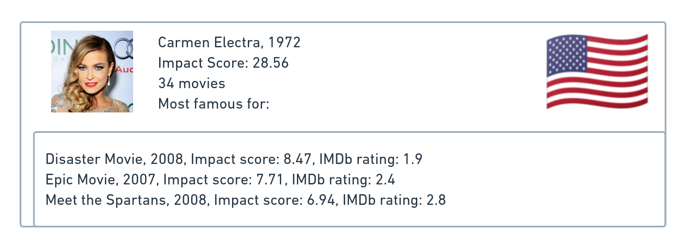

<head>

</head>

# Introduction

The representation of women in media has long been a topic of interest, as it reflects societal norms and attitudes towards gender equality. Despite the progress made in recent decades towards gender equality, it is important to examine whether these changes are reflected in the films we watch. Movies provide a unique insight into the subconscious ways in which society is conditioned to view women, and can capture the ideals and norms of the time in which they were produced. 

In this data analysis project, we will use the CMU Movie Summary Corpus dataset, completed with additional datasets, to explore the portrayal of women in film. We will not only analyze the roles of actresses and characters, but also of writers and directors. By analyzing these factors, we aim to gain a deeper understanding of how women are and have been represented in media, and how this has evolved through time.

# The Data

Our analysis is based on merging the [CMU Movie Summary Corpus dataset](https://www.cs.cmu.edu/~ark/personas/), the [Stanford CoreNLP-processed summaries](http://www.cs.cmu.edu/~ark/personas/data/corenlp_plot_summaries.tar), [IMDb](https://www.imdb.com/interfaces/), [Wikidata](https://www.wikidata.org/wiki/Wikidata:Main_Page), [IMDB](https://www.imdb.com/interfaces/) and [Box office Mojo](https://www.boxofficemojo.com/). We have separated the data into three tables: the movies table, the characters table, and the directors and writers table.

* The movies table contains titles, release year, runtime, box office revenue, average rating and number of votes on IMDb, genre, as well as the list of directors and writers. There are a total of 81,741 different movies.



* The characters table contains the ID of the movie, the character name and actor name, their height, ethnicity, birth and death year, the movie metric and the actor metric. There are 450,669 characters played by 135,761 different actors.



* The directors and writers table contains titles, role (either director or writer), name, gender, birth year, and height. There are a total of 86,474 directors and 164,271 writers.



## The Impact Score metric
### Movies
We have created a metric in order to measure the impact of a movie on the average rating and the number of votes. Our assumption is that an impactful movie has a lot of votes and has either an extremely good or bad average rating.

We apply a logarithmic transformation to the number of votes in order to turn its heavy-tailed distribution into a gaussian distribution, then we normalize the data and accurately compare the impact of different movies. We then take the absolute value of the normalized average rating for each movie. This accounts for both very good and very bad movies, as both have a significant impact on audience reception. By combining these two factors, we are able to calculate the overall impact a movie has on its audience and compare this across different films.

$$\textrm{Impact Score}_\textrm{Movies} = \textrm{normalized} (\log(\textrm{number of votes})) \cdot \textrm{abs}(\textrm{normalized}(\textrm{IMDB rating}))$$

According to this metric, those are the top 10 most impactful movies of our dataset:



### Actors, writers and directors
For actors, writers, and directors, we use the [Discounted Cumulative Gain](https://en.wikipedia.org/wiki/Discounted_cumulative_gain) to rank the movies they are linked to according to the impact score and compute their overall impact.

$$\textrm{Impact Score}_\textrm{Actors, Directors, Writers} = \sum_{i=1}^{\textrm{number of movies}}\frac{\textrm{movie metric}_i}{\log_2(i + 1)}$$

Here are the top 10 actors, writers and directors with the highest impact score:



We can see that the top 10 actors, writers and directors are all male, which leads to the following question: *where are the women?*

# Where are the Women?

As our project focuses on the representation of women in movies, it can be interesting to look at the evolution of the presence of women in movies, as characters and as part of the crew.



From the graph above, we can see that women in crews have always been even more underrepresented than actresses.

Let's break the data down by genre, to see if there is any difference in the distribution of women in film across genres.




From the graphs above, we can see that when it comes to genre, women are most often represented in dramas, comedies and romances, while they are underrepresented in action adventure and sci-fi films.

When considering the representation of women among directors and writers, we found that the pattern is similar, although the overall percentage of women in these roles is significantly lower than for actresses, as shown below.



# Behind the Camera

Put the director analysis here. Who are the most impactful directors for the most common genres? What are their best movies? What are they about? how does the impact of female directors compare with male directors?

# In Front of the Camera

Put the Actor analysis here

# On the Screen

To analyze the way different genres are portrayed in movies, we took a look at the plot summaries provided for 42k movies in the CMU dataset. We use the output of the Stanford CoreNLP pipeline to acquire information about characters. 

Not all characters in the movie are equally significant, we consider the characters mentioned in the plot summaries as main characters since they are valuable enough to the plot to get represented in the condensed description of the movie



We can see that both for all characters and for the main characters the distribution mass for males is concentrated more towards the right, which means there are generally more male characters in movies. This tendency is true for all decades. Nevertheless, for the main characters, we can notice that the distributions are more balanced.

Since we perform the analysis of textual descriptions, we focus only on the main characters.

To see how the characters are portrayed we extract the attributes (descriptive adjectives) associated with the characters in the plots.

To highlight the differences in attribute distributions we consider unique attributes which are specific to one of the genders. 

The drop in number of unique attributes in the last decade can be explained by the fact that the CMU movie dataset was released in 2013, so the decade is underrepresented.



We see that the number of attributes is lower for female characters than for male ones. 
Nevertheless, the number of unique terms per character is consistently higher for females than for males. This can mean that even though there are fewer female characters they are more developed and thought-through.
Interestingly enough, the general trend of the number of attributes per character is decreasing. So there are more characters in the movies, but they might possess the same set of typical qualities.

### Word clouds 

To get an idea of the kind of data we are dealing with, we look at the word clouds of unique attributes for each gender and decade. 

An interesting finding from this data is that for each decade popular male attributes include some kind of aggressive characteristics: **enraged, angry, cruel, abusive**



### Word embeddings

Word clouds give us an understanding of certain trends but they focus on exact formulations and not semantics, to capture the similarities of the words and to see if they form some natural groups we perform clustering over the attributes using fasttext to produce attribute embeddings.



For every decade we can find an “aggressive” cluster for male characters, which is in line with our word cloud observations. Another tendency is that negative characteristics are prevalent amongst female attributes throughout the decades: unfaithful, unworthy, sad. Throughout time female attributes traverse from more temporal (current emotions or states, e.g. heartbroken, unloved) to intrinsic (proud, clever, talkative), while male characters have the opposing trend (from intrinsic only to emotional state descriptions). Additionally, females have appearance-related attributes (overweight, hot, ugly) which are less typical for male characters.

### Regression analysis

To verify our “**aggressive**“ hypothesis we perform regression analysis on the movie plots. We use sentiment analysis to acquire the general sentiment of the movie plot. Apart from that, we use “**aggression**”, “**dispute**”and **“violence**” lexical categories of the empath sentiment analysis. 

For the scores of each category we make a linear regression model based on the share of female characters in the movie. Of course, the sentiment or aggression score of a movie is impossible objective to model only with information about the share of female characters, which explains the low R-score values that we got with the linear models (0.001 - 0.02). Nevertheless, for each of the objectives we got a statistically significant coefficient for the share of female characters which was negative for “**aggression**”, “**dispute**”and **“violence**” and positive for the sentiment.

This means that the more female characters there is in the movie the less its plot’s aggression/dispute/violence score and the more positive sentiment would be on average.

# Women of Impact

Those are the three most impactful actresses in the dataset:

{:class="img-responsive"}
{:class="img-responsive"}
{:class="img-responsive"}

It is interesting to note that one of Uma Thurman's three most impactful films received very negative ratings, while the other two were rated positively. On the other hand, all three of Cate Blanchett's most impactful films had a positive impact, but Carmen Electra's three most impactful films were largely criticized. 

# That’s a Wrap!

In conclusion, the representation of women in media is limited and often stereotypical. However, there are many talented and successful women in the industry who are making a significant impact. It is important for the industry to continue to strive for greater diversity and representation, in order to create a more accurate and fair portrayal of women in media.
